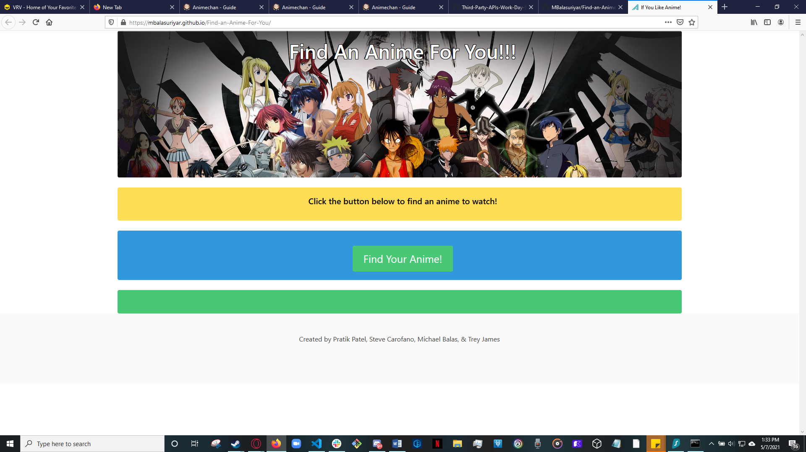
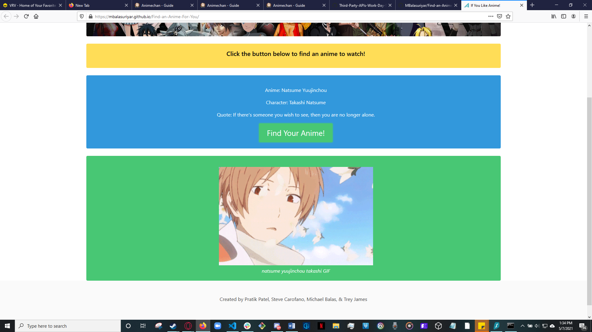

# Anime Finder (group project)

An interactive webpage that produces a random anime by making use of multiple API's.  
## https://mbalasuriyar.github.io/Find-an-Anime-For-You/


## User Story

```

AS A fan of japanese anime
I WANT to be able to find random shows
FOR finding new favorites

```

## Project Completion Criteria:
1. Producing a randomly pulled anime
2. Page should show Anime name
3. Page should name a charater is in the anime and a quote by said character
4. Page should show an available gif from the anime
5. Console log should be stored into local storage
6. Console Log should still be present when page is refreshed






```
```


## Conributers
[Pratik Patel](https://github.com/PratikPatel-Code/), [Steve Carofano](https://github.com/stevecarofano), 
[Trey James](https://github.com/tdjames20), [Michael Balasuriyar](https://github.com/MBalasuriyar)


#
## Built With:
[Visual Studio](https://visualstudio.microsoft.com/)

[CSS (BULMA)](https://bulma.io/)

[JavaScript](https://www.javascript.com/)

[Animechan API](https://animechan.vercel.app/)

[Giphy API](https://api.giphy.com)


#
## Links:

[Github Repository](https://github.com/MBalasuriyar/Find-an-Anime-For-You)

[Find an Anime For You](https://mbalasuriyar.github.io/Find-an-Anime-For-You/)